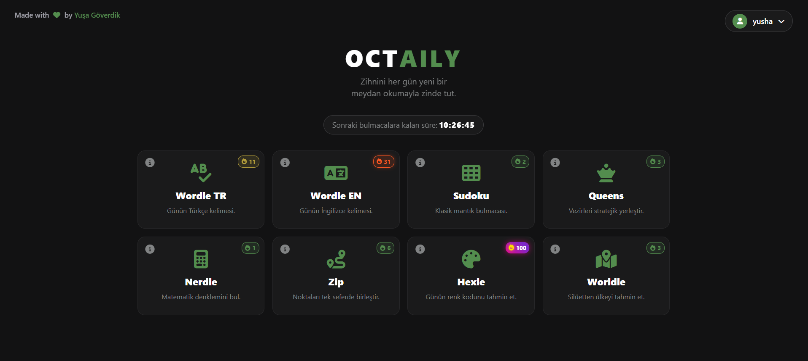
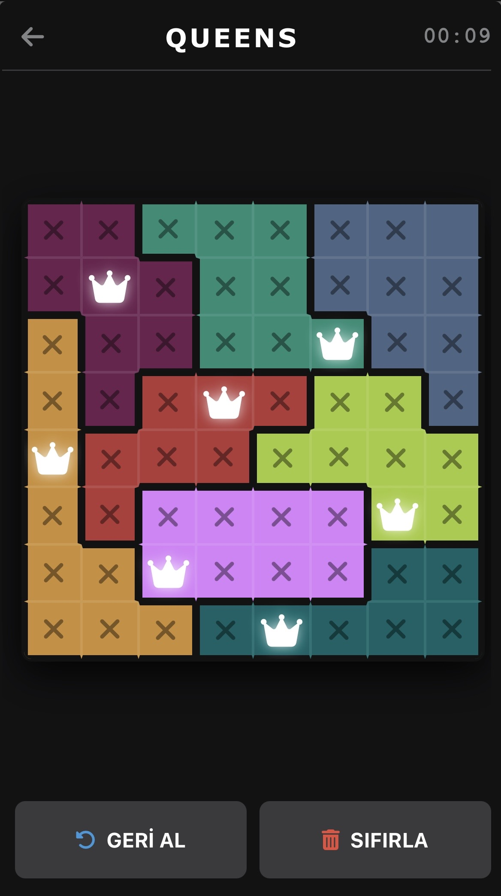

# Octaily

The Octaily Web Client serves as the presentation layer for the Octaily daily puzzle platform. Developed using Delphi (UniGUI) and deeply customized with modern HTML5, CSS3, and Vanilla JavaScript, this client delivers a highly responsive, native-app-like experience across desktop and mobile environments. Octaily is built mainly with JavaScript.

Operating as a decoupled frontend, it communicates asynchronously with the Octaily API Service to fetch daily puzzle grids, validate user interactions, and manage secure session data.

*Note: The application's user interface is currently available exclusively in Turkish.*

---

## Visual Overview

  
   
  <em>Figure 1: Main Dashboard and Puzzle Grid (Desktop)</em>

 

  &nbsp;&nbsp;&nbsp;&nbsp;
  
   
  <em>Figure 2: Mobile Gameplay Interface demonstrating safe-area integration.</em>

---

## UI/UX Architecture and Features

The client is engineered to bypass standard framework limitations, ensuring optimal rendering and interaction design:

* **Strict Mobile Optimization:** Utilizes dynamic viewport units (`100dvh`) and device-specific environment variables (`env(safe-area-inset)`) to guarantee structural integrity on mobile browsers (iOS Safari, Android Chrome). Prevents viewport shifting, rubber-band scrolling, and unwanted zoom behaviors.
* **Framework Style Override:** Aggressively overrides default ExtJS (UniGUI) structural classes (e.g., `.x-window`, `.x-body`) to enforce a pure, uninterrupted `#121213` dark mode layout without legacy borders or backgrounds.
* **Dynamic Streak Mechanics:** Gamifies user retention through a tiered visual badge system. As players maintain consecutive daily wins, their dashboard cards dynamically upgrade across multiple visual tiers, culminating in an animated, gradient-driven "God Tier" badge.
* **3D Transform Layouts:** Implements hardware-accelerated CSS `perspective` and `transform-style: preserve-3d` for interactive card-flipping mechanics and paginated game rules.
* **Touch-Device Isolation:** Utilizes advanced media queries (`@media (hover: hover)`) to separate desktop hover animations from touch-device interactions, preventing UI state bugs on mobile.
* **Secure Authentication UI:** A custom-built, glassmorphism-themed authentication flow supporting dynamic OTP (One-Time Password) timers, robust client-side validation, and active session management.
* **Comprehensive Analytics Modal:** A scroll-optimized, responsive dashboard modal tracking user streaks, max scores, total matches, and win rates across all puzzles.

---

## Supported Game Interfaces

The frontend natively renders custom grids and input mechanisms for 8 daily logic engines:

* **Wordle (TR & EN):** Interactive virtual keyboards with precise color-coded state transitions.
* **Sudoku:** Real-time 9x9 matrix rendering with localized cell highlighting.
* **Nerdle:** Mathematical operator and numeric input handling.
* **Hexle, Worldle, Queens, & Zip:** Specialized DOM structures designed to handle geographic, color-logic, and spatial path-finding mechanics.

---

## Technical Stack

* **Backend Communication:** Asynchronous request handling via UniGUI's `ajaxRequest` protocol, ensuring seamless Delphi-to-JavaScript data bridges.
* **Styling Strategy:** Zero-dependency, pure CSS. Architecture relies heavily on CSS Variables (`:root`) for maintainable theming, text-balancing algorithms, and flexbox/grid hybrid layouts.
* **DOM Manipulation:** 100% Vanilla JavaScript. No external frontend frameworks (React, Vue, etc.) were used, minimizing payload and maximizing execution speed.

---

## Installation and Execution

1. Clone the repository: `git clone https://github.com/yushadev0/octaily.git`
2. Open `OctailyClient.dproj` within your Delphi IDE (10.4 or newer).
3. Ensure the **UniGUI** framework is installed, licensed, and configured in your environment.
4. Verify that the API endpoint variables in the project point to your active Octaily API Service.
5. Compile and run the project (F9). Access the client application via your preferred web browser at `http://localhost:8077` (default UniGUI port).

---

*For backend service setup, please refer to the [Octaily API Service Repository](https://github.com/yushadev0/octaily-service).*